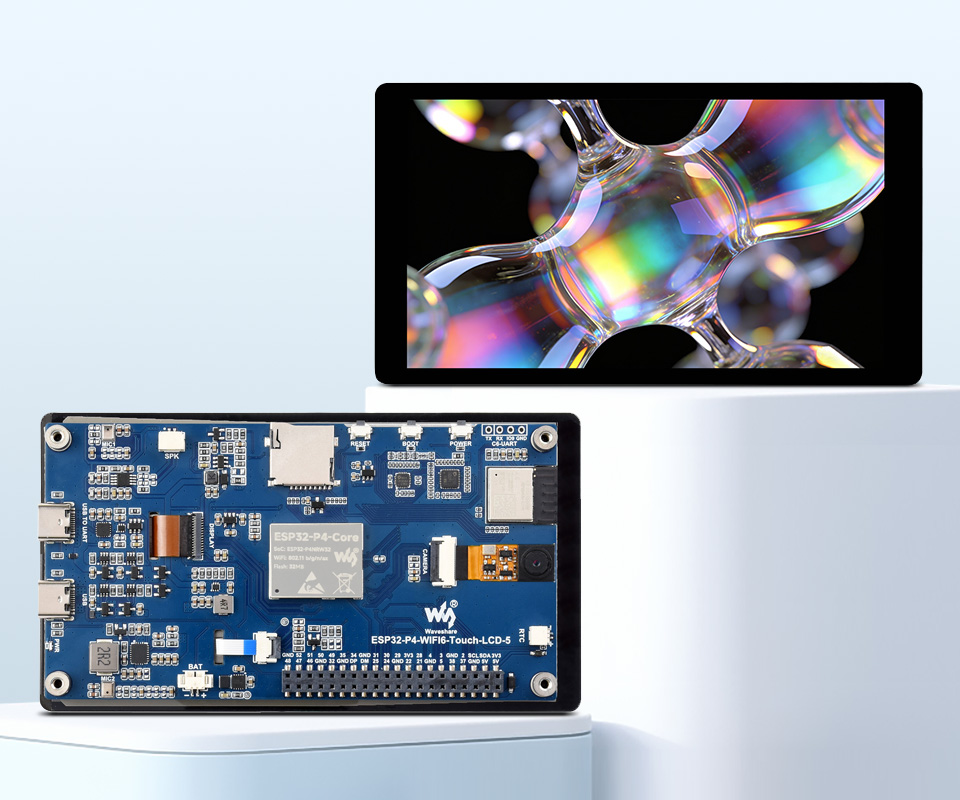

<div align="center">
  <h1>ESP32-P4-WIFI6-Touch-LCD-5</h1>
  <p><strong>ESP32-P4 development board with a 5-inch 720 × 1280 MIPI-DSI display, capacitive touch, Wi-Fi 6, audio, a MIPI-CSI camera interface, and USB expansion</strong></p>
  <p>
    <a href="https://github.com/waveshareteam/ESP32-P4-WIFI6-Touch-LCD-5/actions/workflows/esp-idf-examples.yml"></a>
    <a href="LICENSE.txt"></a>
  </p>
  <p>
    <a href="README_ZH.md">中文</a> ·
    <a href="https://www.waveshare.com/esp32-p4-wifi6-touch-lcd-5.htm">🌐 Product Page</a> ·
    <a href="https://docs.waveshare.com/ESP32-P4-WIFI6-Touch-LCD-5">📚 Documentation</a> ·
    <a href="firmware/">📦 Factory Firmware</a> ·
    <a href="examples/esp-idf/">🧩 ESP-IDF Examples</a>
    <a href="examples/arduino/">🔧 Arduino Examples</a>
  </p>
  
</div>

---

## ✨ Overview

This repository provides 12 first-party ESP-IDF examples, factory flashing firmware,
and a schematic for the Waveshare ESP32-P4-WIFI6-Touch-LCD-5.

The board combines an ESP32-P4 with a 5-inch portrait touch display, an ESP32-C6
wireless coprocessor, audio input and output, high-speed USB, microSD storage, a
MIPI-CSI camera interface, and a 40-pin expansion header. It is designed for HMI,
multimedia, edge-computing, and connected-device applications.

## 🖥️ Hardware Overview

| Feature | Device / interface |
| --- | --- |
| MCU | ESP32-P4NRW32 with dual-core and low-power single-core RISC-V processors |
| Memory | 32 MB in-package PSRAM and 32 MB NOR Flash |
| Wireless | ESP32-C6-MINI-1 over SDIO, providing 2.4 GHz Wi-Fi 6 and Bluetooth 5 LE |
| Display | 5-inch 720 × 1280 IPS LCD, 2-lane MIPI-DSI, HX8394 controller |
| Touch | GT911 capacitive touch controller, supporting up to five touch points |
| Audio | ES7210 audio input, ES8311 codec, dual microphones, and an 8 Ω / 2 W speaker connector |
| Storage | microSD / TF card slot using SDIO 3.0 |
| Camera | 2-lane MIPI-CSI interface with optional OV5647 camera |
| USB | USB-to-UART and USB OTG 2.0 High Speed Type-C ports |
| Expansion | 40-pin GPIO header compatible with selected Raspberry Pi HATs; a suitable pin-header adapter may be required |
| Board support | Registry components `waveshare/esp32_p4_wifi6_touch_lcd_5` ^1.0.3 and `waveshare/esp_lcd_hx8394` ^2.1.0 |
| Hardware files | [Schematic](hardware/schematic/ESP32-P4-WIFI6-Touch-LCD-5-Schematic.pdf) |

For complete product specifications, interfaces, and hardware instructions, see the
[official documentation](https://docs.waveshare.com/ESP32-P4-WIFI6-Touch-LCD-5).

## 🚀 Getting Started

1. Install a supported ESP-IDF version and activate its environment.
2. Open one of the projects under [`examples/esp-idf/`](examples/esp-idf/).
3. Set the target, build, flash, and monitor the selected project:

   ```bash
   idf.py set-target esp32p4
   idf.py build
   idf.py flash monitor
   ```

The official product documentation contains the complete setup, connection, and
firmware flashing instructions.

The example defaults select the revision-1.3/pre-v3 ESP32-P4 profile. Display
examples 07–12 resolve the LCD5 BSP `^1.0.3` and the HX8394 driver `^2.1.0`
from the ESP Component Registry. The standalone HX8394 default sends its I2C
command sequence, while the LCD5 BSP selects the board-specific skip behavior.
HIL on the target board is required before relying on display behavior or
changing either version.

> [!NOTE]
> Wireless examples use the onboard ESP32-C6 coprocessor. Keep the ESP32-P4 host
> components and ESP32-C6 slave firmware compatible when changing either side.
> See the [host/slave compatibility contract](docs/P4_C6_HOSTED_WIFI.md).

## 🔧 Arduino Examples

Ten first-party Arduino sketches are bundled under [`examples/arduino/`](examples/arduino/),
covering the DSI display (Arduino_GFX), GT911 touch drawing, LVGL 9 UI, a graphical Wi-Fi
scan, ES8311 melody playback, ES7210 microphone capture, microSD storage, OV5647 MIPI-CSI
camera preview, and an interactive camera ISP/3A tuning demo. Board settings and example descriptions are listed in
[`examples/arduino/README.md`](examples/arduino/README.md). The sketches use the Arduino-ESP32
core `3.3.11` with PSRAM enabled and are packaged as real offset-addressed segments
(no merged/whole-flash image).

## 🧪 ESP-IDF Examples

| Example | Focus |
| --- | --- |
| [`01_HowToCreateProject`](examples/esp-idf/01_HowToCreateProject/) | Minimal ESP-IDF project template |
| [`02_HelloWorld`](examples/esp-idf/02_HelloWorld/) | Basic application and console output |
| [`03_i2c_tools`](examples/esp-idf/03_i2c_tools/) | I2C bus scanning and diagnostics |
| [`04_wifistation`](examples/esp-idf/04_wifistation/) | Wi-Fi station through the ESP32-C6 coprocessor |
| [`05_sdmmc`](examples/esp-idf/05_sdmmc/) | microSD storage using SD/MMC |
| [`06_I2SCodec`](examples/esp-idf/06_I2SCodec/) | ES8311 I2S audio playback and echo test |
| [`07_Displaycolorbar`](examples/esp-idf/07_Displaycolorbar/) | MIPI-DSI LCD color-bar test |
| [`08_lvgl_demo_v9`](examples/esp-idf/08_lvgl_demo_v9/) | LVGL 9 display and touch demo |
| [`09_video_lcd_display`](examples/esp-idf/09_video_lcd_display/) | MIPI-CSI camera preview on the LCD |
| [`10_mp4_player`](examples/esp-idf/10_mp4_player/) | MP4 video playback |
| [`11_esp_brookesia_phone`](examples/esp-idf/11_esp_brookesia_phone/) | ESP-Brookesia phone-style UI |
| [`12_usb_extend_screen`](examples/esp-idf/12_usb_extend_screen/) | USB extended-display application |

## 🛠️ CI Matrix

| Surface | Version | Matrix builds |
| --- | --- | ---: |
| ESP-IDF | `v5.5.5` | 12 |
| ESP-IDF | `v6.0.2` | 12 |

The [ESP-IDF examples workflow](https://github.com/waveshareteam/ESP32-P4-WIFI6-Touch-LCD-5/actions/workflows/esp-idf-examples.yml)
runs an always-visible lightweight repository-policy job, then selects only the
first-party projects affected by the complete diff. Shared build inputs select
the full 24-job matrix, while documentation-only and firmware-only changes do
not spend product-build capacity. The final aggregate status remains visible in
every case. See [CI discovery and routing](docs/CI.md).

CI verifies compile compatibility for the exact pull-request head SHA; hardware
behavior still requires validation on the board against the schematic and
product documentation. The repository has no maintained revision-3 product
firmware source, so revision-specific product-firmware jobs, artifacts, and
flasher probes are not included in this example migration.

## 🗂️ Repository Layout

| Path | Purpose |
| --- | --- |
| [`.github/`](.github/) | ESP-IDF project discovery and GitHub Actions workflow |
| [`assets/`](assets/) | Product images used by the documentation |
| [`docs/`](docs/) | CI, component, hardware, and hosted-Wi-Fi maintenance contracts |
| [`examples/esp-idf/`](examples/esp-idf/) | First-party ESP-IDF projects |
| [`firmware/`](firmware/) | Factory flashing firmware |
| [`hardware/schematic/`](hardware/schematic/) | Product schematic |
| [`CONTRIBUTING.md`](CONTRIBUTING.md) | Contribution and validation workflow |
| [`SUPPORT.md`](SUPPORT.md) | Support scope and public-log privacy guidance |
| [`LICENSE.txt`](LICENSE.txt) | Apache License 2.0 |

## 📦 Factory Firmware

[`firmware/ESP32-P4-WIFI6-Touch-LCD-5-FactoryOnly-260127.bin`](firmware/ESP32-P4-WIFI6-Touch-LCD-5-FactoryOnly-260127.bin)
is a checked-in factory flashing image. It is not a CI build output or a source
project. Source and build instructions for this factory image are not included in
this repository yet and may be added in a later update. Follow the
[official flashing documentation](https://docs.waveshare.com/ESP32-P4-WIFI6-Touch-LCD-5/Firmware-Flashing)
before using it.

## 📚 Documentation

- [Product Page](https://www.waveshare.com/esp32-p4-wifi6-touch-lcd-5.htm)
- [Product Documentation](https://docs.waveshare.com/ESP32-P4-WIFI6-Touch-LCD-5)
- [Product Schematic](hardware/schematic/ESP32-P4-WIFI6-Touch-LCD-5-Schematic.pdf)
- [ESP-IDF Examples](examples/esp-idf/)
- [Repository Documentation](docs/README.md)
- [CI Discovery and Routing](docs/CI.md)
- [Component Policy](docs/COMPONENTS.md)
- [Schematic-backed Hardware Validation](docs/HARDWARE.md)
- [P4/C6 Hosted Wi-Fi Compatibility](docs/P4_C6_HOSTED_WIFI.md)

## 🤝 Support and Contributions

Contributions and reproducible issue reports are welcome. Include the board and
hardware revision, example path, ESP-IDF version, reproduction steps, expected and
actual behavior, and relevant build or serial logs. Remove credentials, network
secrets, personal data, actual device identifiers, and machine-specific paths
before posting logs publicly.

- [Open an Issue](https://github.com/waveshareteam/ESP32-P4-WIFI6-Touch-LCD-5/issues/new)
- [Contribution Guide](CONTRIBUTING.md)
- [Support Guide](SUPPORT.md)
- [Official Support](https://docs.waveshare.com/ESP32-P4-WIFI6-Touch-LCD-5/Technical-Support)

## 📄 License

This repository is licensed under the Apache License 2.0. See
[`LICENSE.txt`](LICENSE.txt) for details.
